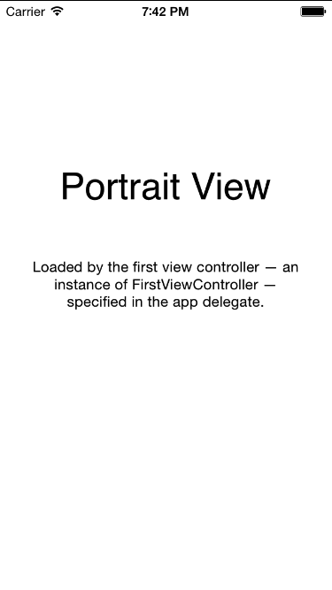
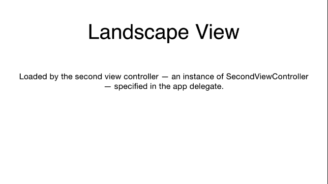

# AlternativeLayouts
A simple iOS project to demo alternative iOS layouts using UITabBarController
It has 2 tabs:

- Tab index 0 is used in Portrait mode.
- Tab index 1 is used in Landscape mode.

When device is rotated, the corresponding view will be shown. It was used when you want to show different views in different orientation.

Original problem was described in [stackoverflow] [1].

[1]:http://stackoverflow.com/questions/18595561/alternative-ios-layouts-for-portrait-and-landscape-using-just-one-xib-file